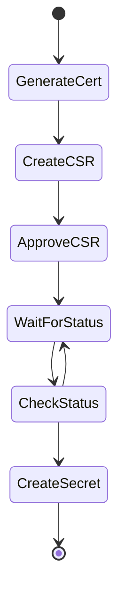

### Description
certificate-helper is a kubernetes operator to automate the process of generating certificates and storing them as secrets for k8s services

Certificate-helper 
* creates the certificate signing request
* approves the certificate signing request
* stores the certificate as a secret with `tls.crt` and `tls.key`

### Installation
1. Install Webhook-helper `kubectl apply -f https://raw.githubusercontent.com/rc1405/webhook-helper/main/webhook-helper.yaml`
> * `kubectl get pods -n webhook-helper -w`
1. Install certificate helper `kubectl apply -f https://raw.githubusercontent.com/rc1405/k8s-certificate-helper/main/certificate-helper.yaml`
1. `kubectl get pods -n certificate-helper -w`
1.  Wait for bootstrap to finish deployment

### Usage
#### Example: example.yaml
```
apiVersion: certificate-helper.io/v1
kind: Certificate
metadata:
  name: my-certificate
spec: 
  namespace: my-example-namespace
  service: my-service
  alt_names:
    - db.my-service
    - api.my-service
```
#### Field Breakdown
* `namespace`: Kubernetes namespace to deploy to (will overwrite anything in the deployment)
* `service`: Name of the service to create the certificate for
* `alt_names`: List of additional names to include as alt names in the certificate

### Process Flow
#### Deployment


### Local Development
1. Run `cargo build --release --features local`
1. Run `docker build -t rc1405/certificate-helper .`
1. Update [deployment PodSpec](certificate-helper.yaml) and add `imagePullPolicy: Never`
1. Run `kubectl apply -f certificate-helper.yaml`

### Deletion
1. `kubectl delete -f https://raw.githubusercontent.com/rc1405/certificate-helper/main/certificate-helper.yaml`